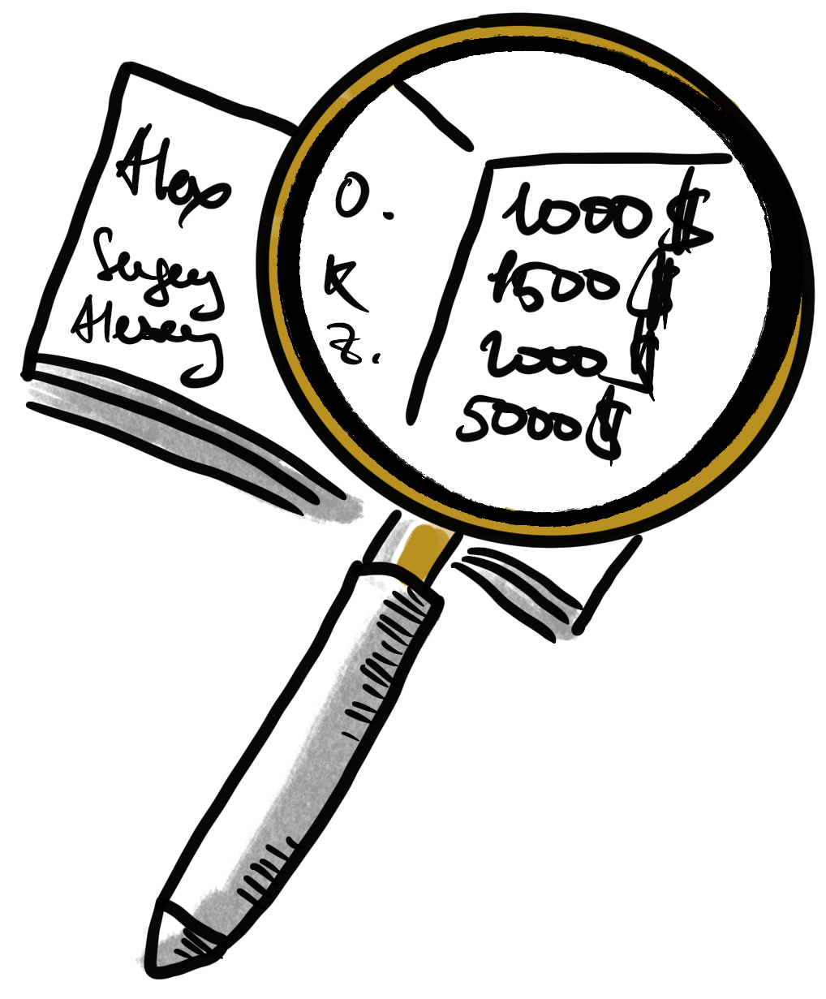

<h1 align="center">Open Salaries</h1>

A list of companies, case studies, and videos that help you implement transparent and open salary policy.

    

  

## Videos 🍿

- [How We Replaced Salary Negotiations with a Sinatra App](https://www.youtube.com/watch?v=N8u9H6JDAzo) by Konstantin Hasse
- [Open Salaries](https://www.youtube.com/watch?v=sf5r4yLTc9k) by Martin Andrews
- [Open Salaries: from Employees to Managing Partners](https://www.youtube.com/watch?v=P7_dq2YiHJ8) by Alexey Voronin
- [Peer to Peer Salary Review in a Corpo: Case Study](https://www.youtube.com/watch?v=vQMYjpjpelg) by Jakub Nabrdalik
- [Why Do We Keep Our Salaries Secret?](https://www.youtube.com/watch?v=iNgB-j4-5HY) by David Burkus

## Case Studies 📚
- [Career at Niteo](https://github.com/niteoweb/handbook/blob/master/5_People/career.md) by Niteo (🇱🇮 Liechtenstein)
- [Coding Salaries in 2019: Updating the Stack Overflow Salary Calculator](https://stackoverflow.blog/2019/10/16/coding-salaries-in-2019-updating-the-stack-overflow-salary-calculator/) by StackOverflow (New York, 🇺🇸 USA)
- [Devising a Profit Sharing Program for Micro-Multinationals](https://blog.balsamiq.com/profitsharing/) by Balsamiq (California, 🇺🇸 USA)
- [Fog Creek Compensation](https://www.joelonsoftware.com/2000/08/30/fog-creek-compensation/) by Fog Creek (New York, 🇺🇸 USA)
- [GitLab’s Global Compensation Calculator: The next iteration](https://about.gitlab.com/blog/2018/03/23/gitlabs-global-compensation-calculator-the-next-iteration/) by GitLab (California, 🇺🇸 USA)
- [How Do We Work at OpenClassrooms](https://openclassrooms.com/en/courses/3851206-how-do-we-work-at-openclassrooms/6523261-evolution-and-salary) by OpenClassrooms (🇫🇷 France)
- [How We Pay People at Basecamp](https://m.signalvnoise.com/how-we-pay-people-at-basecamp/) by Basecamp (Illinois, 🇺🇸 USA)
- [How and Why Open Salary Model Works](https://cogent.co/blog/open-salaries/) by Cogent (D.C., 🇺🇸 USA)
- [Introducing Open Salaries at Buffer](https://buffer.com/resources/introducing-open-salaries-at-buffer-including-our-transparent-formula-and-all-individual-salaries/) by Buffer (California, 🇺🇸 USA)
- [Open Salaries: Outcomes](https://blog.lunarlogic.io/2016/open-salaries-outcomes/) by LunarLogic (Oregon, 🇺🇸 USA)
- [Open Salary Formula to become a transparent company](https://management30.com/blog/open-salary-formula/) by Keepler (🇪🇸 Spain)
- [Our Autonomous Compensation System](https://github.com/multunus/Open-Playbook#compensation-system) by Multunus (🇮🇳 India)
- [P2P Salary Review](http://blog.solidcraft.eu/2015/11/p2p-salary-review.html) by Jakub Nabrdalik
- [Open Financials](https://www.codurance.com/publications/2016/02/22/open-financials) by Codurance (🇬🇧 United Kingdom)
- [The August Open Compensation Model for Self-Managed Organizations](https://medium.com/21st-century-organizational-development/the-august-open-compensation-model-for-self-managed-organizations-69f2c5d9649c) by August (California, 🇺🇸 USA)
- [Why an Open Salary Policy Will Make Our Good Rebels Stronger](https://www.goodrebels.com/why-an-open-salary-policy-will-make-our-good-rebels-stronger/) by Good Rebels (🇪🇸 Spain)

## For contributors
Please keep the alphabetical list ordering.

 

